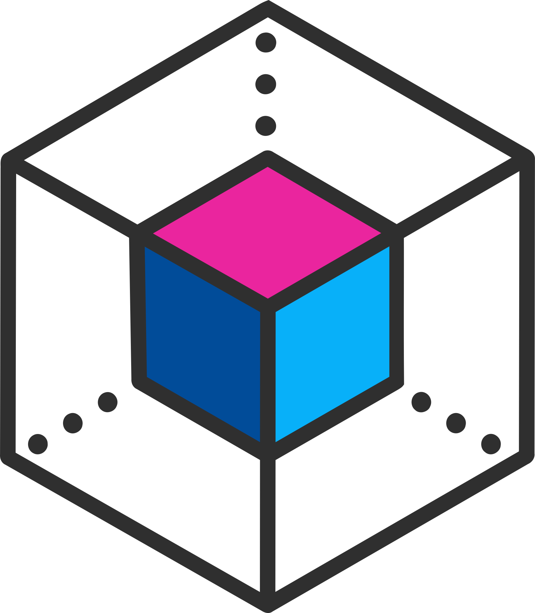

<div align="center">
  
  <h1>Enigma</h1>
  <h3>Everything you need to work with a coding agent, in one command.</h3>
   
  <a href="https://github.com/FJRG2007"> </a>
  <a href="https://ko-fi.com/fjrg2007"> </a>
  <br />
  <br />
  <a href="#">Quickstart</a>
  <span>&nbsp;&nbsp;•&nbsp;&nbsp;</span>
  <a href="https://tpe.li/dsc">Discord</a>
  <br />
  <hr />
</div>

`enigma` installs a shared set of engineering **policy skills** into the agents you
actually use (Claude Code, OpenAI Codex, opencode) and sets up portable **git
security hooks** that block secrets, `.env` files, and dependency dirs from being
committed.

## Install

One command, no global install, no prompts - deploy the skills to every supported
agent at user level:

```bash
npx enigma-cli@latest install --all --yes
```

Or install the command and pick interactively:

```bash
npm install -g enigma-cli      # provides the `enigma` command
enigma install
enigma                         # interactive hub: pick what to set up
```

<table>
<tr>
<td width="50%">

###  Policy skills, everywhere

12 engineering policy skills (security, testing, git, style, debugging...) authored once and deployed to **Claude Code, OpenAI Codex and OpenCode**, sealed with content hashes so tampering is detected. Discard any skill you don't want (`enigma skills discard <name>` or the hub's SKILLS section): it is removed everywhere and skipped by installs/updates until restored.

```bash
npx enigma-cli@latest install --all --yes
```

</td>
<td width="50%">

###  Git security hooks

A portable, dependency-free commit guard for **any** repo: blocks secrets, `.env` files and `node_modules` before they are committed. Commit `.githooks/` and the whole team inherits it.

```bash
enigma security
```

</td>
</tr>
<tr>
<td>

###  Token-efficient output

Optional compression of the agent's chat prose (`off | lite | full | ultra`):

> Normal (69 tokens): "The reason your React component is re-rendering is likely because you're creating a new object reference on each render cycle..."

> Ultra (19 tokens): "New object ref each render. Inline object prop = new ref = re-render. Wrap in `useMemo`."

</td>
<td>

###  Multi-account + profiles

Several logins per tool without logging out, each in its own config dir, switched OS-agnostically. Every account inherits your skills, memory and managed settings (permission bypass, attribution) automatically. Profiles pin one account per tool ("work" = claude:acme + codex:acme) and drive every launch.

```bash
enigma claude work
enigma profile use work
```

</td>
</tr>
<tr>
<td>

###  Interactive hub TUI

A full-screen hub (keyboard + mouse, wheel scroll included) to install skills, set up hooks, manage settings and the unified Accounts & profiles panel - plus auto-sync on every launch and an update notifier.

```bash
enigma
```

</td>
<td>

###  One-command bug reports

Generates a GitHub issue URL with your environment prefilled - OS and version, terminal, detected agents, enigma version and install method - and opens it in the browser.

```bash
enigma issue
```

</td>
</tr>
</table>

That first install is the only one you ever need to run by hand: afterwards,
launching a tool through enigma (e.g. `enigma claude`) **auto-syncs** the deployed
skills and memory with the installed package version, so updates apply without
re-running `enigma install`. Opt out with `enigma config auto-sync off`. Auto-sync
only refreshes what you already installed - it never deploys to a new agent, never
overwrites skills you edited locally, and never rewrites a memory file
(`CLAUDE.md` / `AGENTS.md`) that you authored or edited yourself.

Install also deploys a built-in **`/improve` slash command** to every agent
(Claude Code, opencode and Codex): run `/improve ui` (or `frontend`), `/improve
security`, `/improve performance`, or `/improve seo` to improve that area of the
current project. A same-named command that is not enigma's is replaced so `/improve`
always resolves to enigma's. See the [package README](packages/enigma-cli/README.md#slash-commands)
for details.

Skills also update **without waiting for an npm release**: `enigma install` and
`enigma update` check this repo on GitHub for newer sealed skills, download and
verify them (content hash + provider), and cache them locally so installs and
auto-sync deploy the freshest versions. The check is fully fault-tolerant - if the
GitHub API is down, slow, or rate-limited, enigma silently keeps the bundled
skills - and can be disabled with `enigma config remote-skills off`.

## Requirements

**Minimum:** [Node.js](https://nodejs.org) `>= 18` (with `npm`), [Git](https://git-scm.com)
and at least one coding agent. **Recommended:** add [Claude Code](https://claude.com/claude-code),
the [GitHub CLI](https://cli.github.com), [Bun](https://bun.sh) and [Warp](https://www.warp.dev).

<details>
<summary><b>Details</b> - what each one is for</summary>

### Minimum

|  |  |
|--|--|
| <a href="https://nodejs.org"></a> | `>= 18`, ships with `npm` - installs and runs the `enigma` CLI |
| <a href="https://git-scm.com"></a> | powers the security hooks and the commit guard |
|  | at least one of [Claude Code](https://claude.com/claude-code), [OpenAI Codex](https://github.com/openai/codex) or [opencode](https://opencode.ai) - the skills need a home |

### Recommended

Everything in **Minimum**, plus:

|  |  |
|--|--|
| <a href="https://claude.com/claude-code"></a> | the agent enigma is most battle-tested with |
| <a href="https://cli.github.com"></a> | `gh` commits go through the same hooks, and `enigma issue` opens prefilled reports |
| <a href="https://bun.sh"></a> | only needed to build or contribute from source |
| <a href="https://www.warp.dev"></a> | a modern terminal where the hub TUI shines |

</details>

## Commands

```
enigma                 Interactive menu: choose features to set up
enigma install         Install/update agent skills
enigma update          Fetch the latest skills from GitHub, sync deployments,
                       and self-update enigma-cli when a newer release exists
enigma security        Set up git security hooks in the current repo
enigma guard [--all]   Run the commit guard (staged files, or all tracked)
enigma config [k v]    Show or set runtime toggles (e.g. config commit-emoji off)
enigma <tool> [acct]   Launch claude | codex | opencode with an account's config
                       (explicit > active profile > tool active; auto-syncs first)
enigma account ...     Manage per-tool accounts   enigma profile ...  Group them
enigma skills ...      List skills, discard one (removed everywhere and skipped
                       by installs/updates) or restore it (list/discard/restore)
enigma issue [type]    Prefilled GitHub issue URL (OS, versions, terminal, agents)
enigma seal            Maintenance: (re)compute skill content hashes
enigma check           Integrity gate: verify skills are well-formed and sealed
enigma help | version
```

### Install options

```
-g, --global         User level    -l, --local   This project
-a, --agent <name>   Target agent(s) (default: auto-detect)
-s, --skill <name>   Skill(s) (default: all)
    --all            Every supported agent, ignoring detection
    --bypass <names> Force approval-prompt bypass (claude,codex,opencode | all | none)
    --no-bypass      Skip permission bypass for this run (it is on by default)
    --output-style <off|lite|full|ultra>  Token-efficient output level (asked if omitted)
    --skills-only / --memory-only / --no-prune / --keep-modified / --dry-run
```

### Permission bypass (default on)

By default every install lets each agent (Claude Code, Codex, opencode) skip its
per-action approval prompts, so it stops asking before each edit or command - and
an agent you install later (e.g. Codex after enigma) picks it up on the next
install. This is a deliberate security trade-off, and enigma says so loudly each
time it enables it. Turn it off:

```bash
enigma config permission-bypass off    # disable the default for every agent
enigma config bypass-codex off         # disable one agent (sticks across installs)
enigma install --no-bypass             # skip it for a single run
```

opencode is included but is the least reliable without the approval gate, so use
`enigma config bypass-opencode off` if you want to keep its gate. Your existing
deny rules and other settings are always preserved.

### Token-efficient output (opt-in)

Optionally have the agent compress its chat prose to save output tokens - drop
filler and pleasantries, keep every technical fact. It is chosen at install (or
`enigma config output-style <off|lite|full|ultra>`) and writes a section into the
agent's memory file, so **restart the agent** after changing it:

- `off` - normal full prose (default).
- `lite` - professional and tight: drops filler, keeps grammar and your language.
- `full` - shorter, drops articles and uses fragments.
- `ultra` - telegraphic, maximum compression.

Code, comments, commits, and PRs are always written normally, and the agent
reverts to full prose for security warnings and other safety-critical replies.
You can also switch level mid-session just by asking ("be more terse", "ultra",
"normal mode").

### Minimal code (on by default)

The companion to token-efficient output: where that compresses how the agent
*talks*, this governs how it *builds*. It pushes the agent toward the laziest
solution that works - YAGNI, the standard library and native platform features
before custom code, one line before fifty. It is **on by default at `full`**;
tune it at install or via `enigma config minimal-code <off|lite|full|ultra>`. It
writes a section into the agent's memory file, so **restart the agent** after
changing it:

- `off` - no extra anti-overengineering pressure.
- `lite` - builds what you asked, but names the lazier alternative in one line.
- `full` - the YAGNI ladder enforced: stdlib/native first, shortest working diff (default).
- `ultra` - YAGNI extremist: deletion before addition, challenges the requirement.

Security, input validation at trust boundaries, error handling that prevents
data loss, and accessibility are never simplified away. The full discipline
lives in the `anti-overengineering-policy` skill; you can switch level
mid-session by asking ("be more lazy", "full", "stop minimal-code").

A companion `anti-overengineering-review` skill runs the on-demand,
complexity-only passes: ask to "review this for over-engineering", "audit the
codebase for bloat", or "what can we delete" for a tagged list of cuts
(`stdlib`/`native`/`yagni`/`delete`/`shrink`) with a `net: -N lines` score, or
"list the deferred shortcuts" for a ledger of the `enigma:` markers. It only
lists findings - it never applies them - and leaves correctness and security to
a normal review.

See [`docs/examples/`](docs/examples/README.md) for side-by-side "with vs
without enigma" comparisons (sorting, email validation, date picker, caching,
an API endpoint, and a review pass).

## Git security hooks

`enigma security` drops a portable, dependency-free commit guard into **any** repo
(not just this one): it copies the built guard into the repo's `.githooks/` (as
`guard.mjs`), writes a cross-platform `pre-commit` shim and a toggle config, and points `core.hooksPath`
at it. Commit `.githooks/` so the whole team inherits it. Because the hook runs on
`git commit`, it also covers commits made through the **GitHub CLI** (`gh`), which
shells out to `git`.

On every commit the guard, OS-agnostically:

- **Blocks** committed secrets (API keys, tokens, private keys).
- **Blocks** `.env` / `.env.local` and similar (allows `*.example` / `*.sample` /
  `*.template`).
- **Blocks** dependency/cache dirs (`node_modules`, `__pycache__`, virtualenvs).
- **Warns** on generated dirs (`dist`, `build`, `.next`, `coverage`), log/OS-junk
  files, and files over 5 MB.

Each protection is individually toggleable: the interactive setup uses a
multiselect, and the choices are saved to `.githooks/enigma-guard.json`. Bypass
once with `git commit --no-verify`.

## Quality gates and publishing

This repo gates itself mechanically (it is a tooling distributor, so there is no
app test suite):

```bash
npm run typecheck # tsc --noEmit (tsup does not typecheck)
npm run check     # every skill well-formed and SEALED
npm run guard     # scan all tracked files for secrets, .env, node_modules, ...
npm run verify    # typecheck + check + guard (used by CI)
npm run build     # build dist with tsup (enigma.js + guard.js)
```

- **CI** (`.github/workflows/ci.yml`) runs `npm ci` + `npm run verify` + `npm run
  build` on every push and pull request.
- **Publish** (`.github/workflows/publish.yml`) publishes `enigma-cli` to npm with
  provenance when a GitHub Release is published (or via manual dispatch). It
  requires the `NPM_TOKEN` repo secret and checks that the release tag matches the
  package version.
- **Pre-commit** for this repo: `git config core.hooksPath .githooks`.

Full contributor guide (dev loop, build internals, release flow, local testing):
[`docs/developers/`](docs/developers/README.md).

#### Contributors
To contribute to the project visit the requirements at [`CONTRIBUTING`](./docs/developers/CONTRIBUTING.md).

## License

[Apache-2.0](LICENSE).

<p align="right"><a href="#top">Back to top 🔼</a></p>